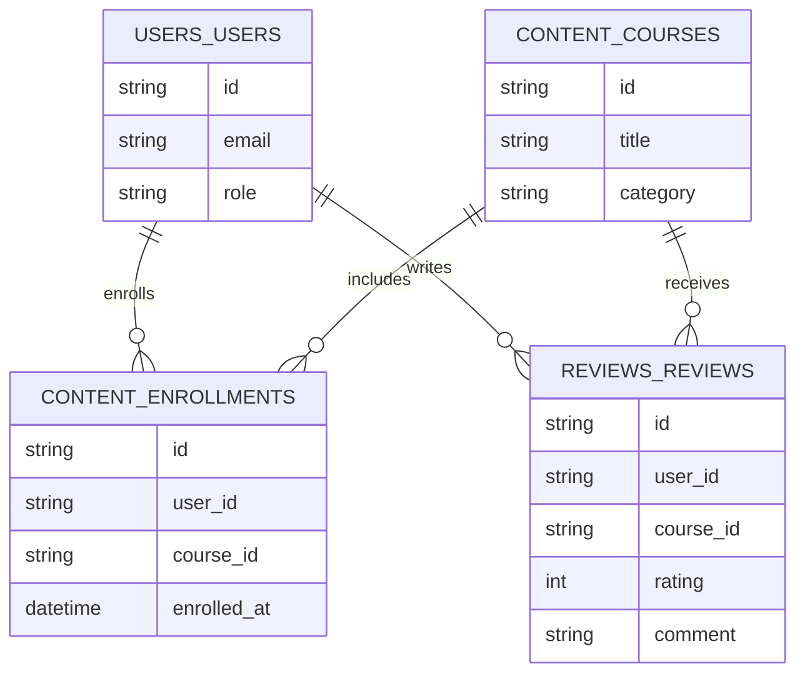

# Diagrama ER (base)

Este diagrama sirve para evidenciar la relacion entre entidades ya catalogadas en Glue.

```mermaid
erDiagram
    USERS_USERS ||--o{ CONTENT_ENROLLMENTS : enrolls
    CONTENT_COURSES ||--o{ CONTENT_ENROLLMENTS : includes
    USERS_USERS ||--o{ REVIEWS_REVIEWS : writes
    CONTENT_COURSES ||--o{ REVIEWS_REVIEWS : receives

    USERS_USERS {
      string id
      string email
      string role
    }

    CONTENT_COURSES {
      string id
      string title
      string category
    }

    CONTENT_ENROLLMENTS {
      string id
      string user_id
      string course_id
      datetime enrolled_at
    }

    REVIEWS_REVIEWS {
      string id
      string user_id
      string course_id
      int rating
      string comment
    }
```

Actualiza nombres/campos cuando tengas el esquema real detectado por Glue.
